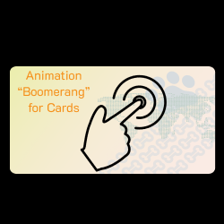

# BoomerangCard

 
  
  

Flipping pet cards (Application written in SwiftUI) implemented with two parameters: Blur and Rotation

## Used Technology Stack:

- SwiftUI
- MVVM

## 1. Boomerang (Effects disabled)

 
 

## 2. Boomerang (Blur disabled)
 
 
 

## 3. Boomerang (Effects included)

 
 

